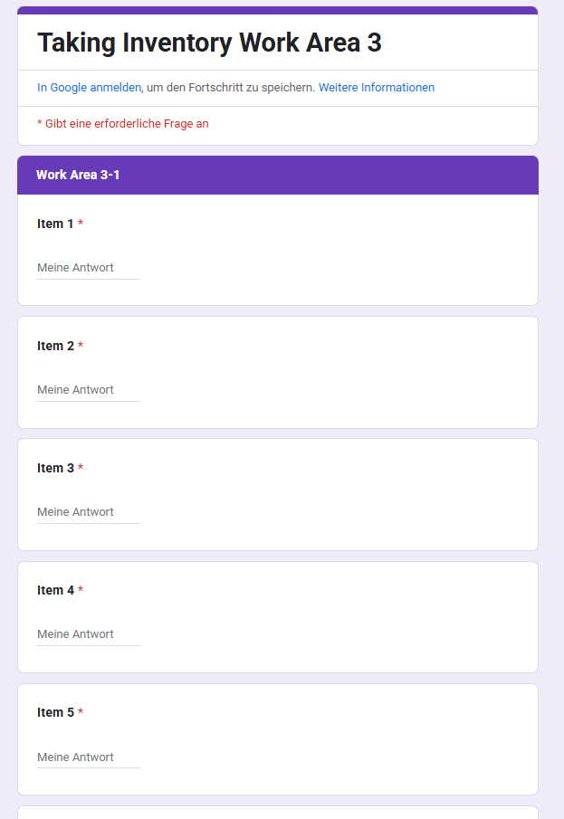
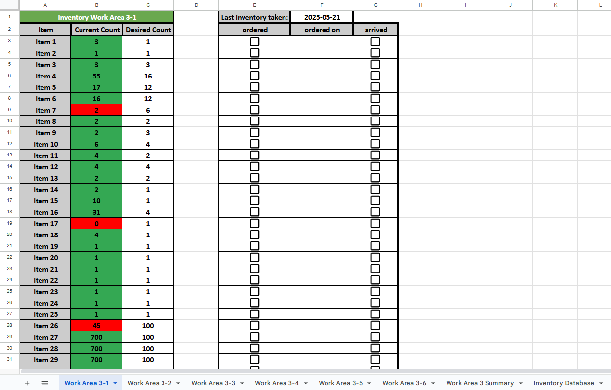
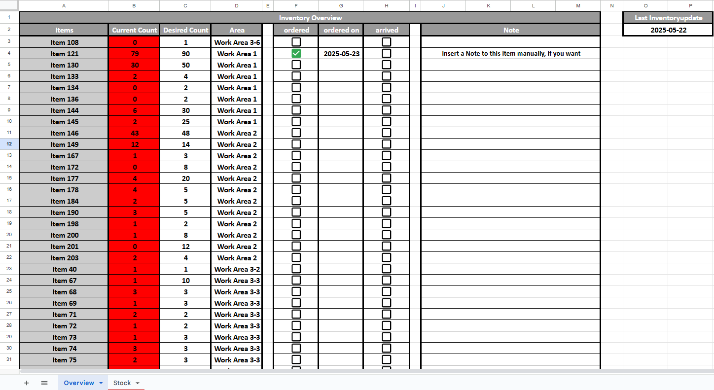

# 📦 Inventory Management System 📦

Dieses Projekt demonstriert ein benutzerfreundliches Inventarverwaltungssystem, das mit **Google Sheets** und **Google Forms** erstellt wurde. Entwickelt für Teams, die eine  Cloud-basierte Inventarlösung wünschen, ohne eine benutzerdefinierte Anwendung erstellen zu müssen.

# 📖 Überblick über das Projekt

Dieses System hilft Teams bei der Bestandsverfolgung, indem die Mitarbeitenden über ein Google Formular die Artikeldaten übermitteln und diese durch die verbundenen Google Tabellen zu einem Inventarsystem zusammenführen.
Das System identifiziert dann fehlende Gegenstände und zeigt eine Live-Übersicht über diese Artikel in einer separaten Übersichtstabelle an.
Die für das Inventar verantwortlichen Personen sehen somit, welche Gegenstände fehlen bzw. zur Neige gehen und können dementsprechend agieren.

## ✨ Wesentliche Merkmale

- ✅ Einfache Google-Formulareingabe für das Eintragen von Gegenständen
- 📄 Automatische Protokollierung von Einträgen in einem verbundenen Google Sheet
- 🔍 Übersichtstabelle, das fehlendes Inventar hervorhebt
- ☁️ Cloud-basiert und von jedem Gerät aus zugänglich
- 🔄 Aktualisierungen ohne manuelle Synchronisierung
- 👨‍👩‍👧‍👦 Perfekt für kleine Teams oder Büros

## 🧑‍💻 Funktionen der Tabellen

### 1. **Inventory Formulare**
- **Beschreibung**: Die Formulare dienen den Mitarbeitenden, um die aktuelle Anzahl der im Inventar bestehenden Gegenstände zu zählen und einzutragen

### 2. **Inventory Tabellen**
- **Beschreibung**: Diese Tabellen dienen zur Aufnahme und Verarbeitung der eingetragenen Inventur der Mitarbeitenden
- **Funktionen**:
  - Eintragen und sortieren der gezählten und eingetragenen Gegenstände
  - Visualisierung von fehlenden Gegenständen mithilfe von bedingter Formatierung
  - Kennzeichnung für andere Mitarbeitende, ob und wann fehlende Gegenstände nachbestellt wurden

### 3. **Overview Tabelle**
- **Beschreibung**: Diese Tabelle zeigt auf einen Blick alle Gegenstände aus allen Arbeitsbereichen, die nachbestellt werden müssen
- **Funktionen**:
  - Automatische Synchronisierung beim Öffnen der Tabelle
  - Möglichkeit Gegenstände der Inventur nicht anzeigen zu lassen, die in anderen Lagerstätten vorrätig sind und nicht direkt nachbestellt werden müssen


### 4. **Monthly Inventory**
- **Beschreibung**: Diese Tabelle speichert den Inventurverlauf jedes Monats
- **Funktionen**:
  - Inventuren, die während eines Monats gemacht wurden, werden monatlich abgespeichert und einen Überblick über die einzelnen Gegenstände zu haben

# ⚙️ Wie man das System verwendet

1. **Kopiere alle Google Sheets und Googel Forms**  
   - [Klicken hier, um zu den Datein zu kommen](https://drive.google.com/drive/folders/1OyHtgi2f7gH7NRjT6i2nvqzGMOVwZifn) 

2. **Füge die Trigger der einzelnen Sheets und Forms hinzu**  
   - Zu finden als trigger.json in den dementsprechenden Ordnern z.B. [Work Area 1/scripts/formscript/trigger.json](https://github.com/kruczekolaf/Inventory-Management/blob/main/Work%20Area%201/scripts/formscript/trigger.json) 

3. **Passe die bedingten Formatierungen der Sheets an**  
   - Wichtig für die automatischen Eintragungen in der Overview

# 📁 Projektstruktur

```
├── Overview/                                   
│ ├── scripts/                                     # Skripts für Bestellanzeige und Update der Overview
│ │   └──[verschiedene Skriptdateien]
│ └── Inventory Overview.xlsx                      # Anzeige der zu bestellenden Gegenstände
│
├── Work Area 1/
│   ├── scripts/                                   # Skripts für Sortierung und Verarbeitung der eingetragenen Inventur
│   │    ├── formscript/
│   │    │   └── [verschiedene Skriptdateien]
│   │    ├── sheetscript/
│   │    │   └── [verschiedene Skriptdateien]
│   ├── Inventory Work Area 1 (Answers).xlsx       # Auflistung der eingetragenen Gegenstände
│   ├── Inventory Work Area 1.xlsx                 # Anzeige der Inventur eines Arbeitsbereiches
│   ├── Work Area 1 Form.json                      # Fragen der Inventur
│   └── Monthly Work Area 1 Inventory.xlsx         # Monatliche Übersicht der eingetragenen Inventuren
│
├── Work Area 2/          
│   ├── scripts/                                   # Skripts für Sortierung und Verarbeitung der eingetragenen Inventur
│   │    ├── formscript/
│   │    │   └── [verschiedene Skriptdateien]
│   │    ├── sheetscript/
│   │    │   └── [verschiedene Skriptdateien]
│   ├── Inventory Work Area 2 (Answers).xlsx       # Auflistung der eingetragenen Gegenstände
│   ├── Inventory Work Area 2.xlsx                 # Anzeige der Inventur eines Arbeitsbereiches
│   ├── Work Area 2 Form.json                      # Fragen der Inventur
│   └── Monthly Work Area 2 Inventory.xlsx         # Monatliche Übersicht der eingetragenen Inventuren
│
├── Work Area 3/
│   ├── scripts/                                   # Skripts für Sortierung und Verarbeitung der eingetragenen Inventur
│   │    ├── formscript/
│   │    │   └── [verschiedene Skriptdateien]
│   │    ├── sheetscript/
│   │    │   └── [verschiedene Skriptdateien]
│   ├── Inventory Work Area 3 (Answers).xlsx       # Auflistung der eingetragenen Gegenstände
│   ├── Inventory Work Area 3.xlsx                 # Anzeige der Inventur eines Arbeitsbereiches
│   ├── Work Area 3 Form.json                      # Fragen der Inventur
│   └── Monthly Work Area 3 Inventory.xlsx         # Monatliche Übersicht der eingetragenen Inventuren
│
├── img/
│    └── [verschiedene Bilddateien]                # Bilder zur Veranschaulichung der Funktionen
│ 
├── LICENSE                                        # Lizenzinformationen für das Repository
│
└── README.md                                      # Projektübersicht
```

# 📷 Vorschau







# 🛡️ License
Dieses Projekt ist unter der [MIT-Lizenz](https://github.com/kruczekolaf/Inventory-Management/blob/main/LICENSE) lizenziert. Es steht Ihnen frei, dieses Projekt zu verwenden, zu verändern und weiterzugeben, wenn Sie es entsprechend kennzeichnen.
